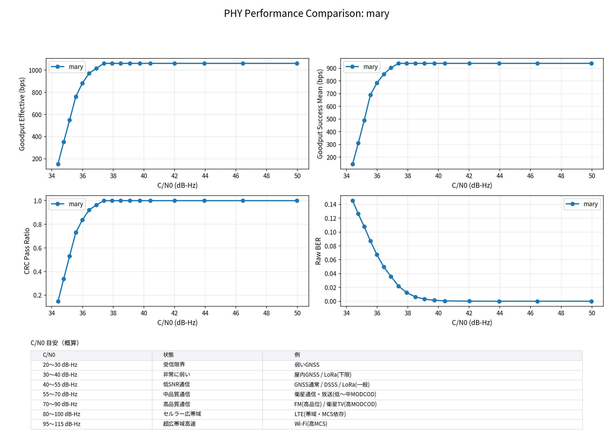

# Mistcast

Mistcastは、ブラウザ上で動作する**小さなデータ（数KB程度）の近距離ブロードキャスト**を目的とした、**音響データ通信（Data-over-Sound）ウェブアプリケーション**です。
スピーカーとマイクを使用し、音響空間を介したデータ伝送を実装しています。

https://github.com/user-attachments/assets/9e2b40ab-bfc8-4fa5-8e5b-f9ce8e6f0eb9

(この動画内音声の信号は現在の実装より古いため、現在のデモでデコードできません)

## 特徴

- **スピーカーとマイクによる近距離ブロードキャスト**: Wi-FiやBluetoothのような事前のペアリング設定は不要です。スピーカーから音を鳴らすだけで、周囲にある複数のデバイス（マイク）へ同時にデータを配信できます。
- **小規模データに特化した設計**: URL、ID、短いテキストなどの「数KB程度の情報」を、周囲のデバイスへ繰り返し、確実に送り届けるユースケースに最適化されています。
- **ストリームのどこからでも受信可能**: ファウンテンコード（消失訂正符号）を採用しており、送信側はデータを継続的に射出し続けます。受信側は通信の途中から参加した場合でも、必要な量のデータを受信した時点で即座に元のデータを復元可能です。
- **ブラウザの標準機能のみ**: Web Audio API および WebAssembly (SIMD) を活用し、専用のアプリやプラグインをインストールすることなく、Webブラウザを開くだけで動作します。

## 用語定義

- **プリアンブル**: 同期開始信号
- **同期語**: バーストの位相同期用既知区間
- **フレーム**: プリアンブル+同期語+バースト
- **バースト**: フレームのうち「パケット×N」の部分
- **パケット**: CRC付き受信単位。ファウンテンコードの1つを含む

## 技術仕様



### 1. 物理レイヤー (物理変調)

Mistcast は、複数の物理層実装を含んでいます。

| 特徴 | 値 (M-ARY Fast) |
| :--- | :--- |
| **変調方式** | 16-ary Orthogonal + DQPSK |
| **伝送効率** | **6 bits / symbol** |
| **インターリーバ** | 12×41=492 bits (効率100%) |
| **拡散率 (SF)** | 16 (Walsh-Hadamard) |
| **チップレート** | 8,000 cps |
| **キャリア周波数** | 15,000 Hz |
| **実効速度 (Goodput)** | **~ 1,060 bps** (2 pkts/frame) |
| **マルチパス対策** | **FDE + 自動パス選択** |

(以前の [DSSS (Slow) モードについてはこちら](./dsp/src/dsss/README.md) を参照してください)

- **共通基盤**:
    - **対称リサンプリング**: 入出力サンプリングレートを内部処理レート（$3 \times R_c$）へ変換し、タイミング累積誤差を抑制。
    - **RRC (Root-Raised Cosine) フィルタ**: ロールオフ係数 0.30 による波形整形。
    - **軟判定復調**: Max-Log-MAP 近似による LLR (対数尤度比) 算出と Viterbi 復号の統合。

## フレーム構造とパケット構造

Mistcastは、物理層（変調フレーム）とデータリンク層（LT符号パケット）の2層構造でデータを伝送します。

### 変調フレーム (Physical Layer Frame)
1回の同期（プリアンブル）で送信される単位です。

```text
|<--- Preamble --->|<- Sync ->|<---------- Data Symbols (Payload) ---------->|
+------------------+----------+----------------------------------------------+
| Zadoff-Chu x 2   | 8-bit    | MaryDQPSK Symbols (Packet 1, 2)              |
| (SF=71)          | (DBPSK)  | (16-ary Walsh Spreading)                     |
+------------------+----------+----------------------------------------------+
^                  ^          ^
|                  |          +-- Payload開始 (基準位相)
|                  +-- フレーム境界確定
+-- タイミング同期 / AGC / CIR推定
```

- **Preamble系列**: **Zadoff-Chu系列** (SF=71) を使用。自己相関サイドローブがゼロであり、FDEのためのCIR（チャネルインパルス応答）推定に利用されます。
- **Sync Word長**: 8ビットを使用。

### パケットフォーマット (Link Layer Packet)
1つのパケットは 30 バイトで構成され、消失訂正符号（ファウンテンコード）の最小単位となります。

```text
|<--- Header (3B) --->|<--- Payload (24B) --->|<-- CRC (3B) -->|
+----------+----------+-----------------------+----------------+
|  lt_k-1  |  lt_seq  |      Data Bytes       |    CRC-24      |
|  (8-bit) | (16-bit) |      (24 bytes)       |  (poly=0x1101DCD) |
+----------+----------+-----------------------+----------------+
```

- **lt_k**: データを分割した際の総ソースブロック数 (1〜255)。
- **lt_seq**: ファウンテンコードのシーケンス番号。
- **データサイズ制限**: `lt_k` が 8ビット（最大255）であるため、一度に送信可能な最大データサイズは **$255 \times 24 = 6,120$ バイト**です。これは「小さなデータのブロードキャスト」という本プロジェクトの設計意図に基づいています。

### パケットの物理層へのマッピング

1つのパケットは FEC およびインターリーバを経て、多値直交変調 (M-ARY) により物理シンボルへ変換されます。

```
パケット (30B) → FECエンコード (246→492 bits) → インターリーバ (492 bits)
                                     ↓
                   MaryDQPSK変調 (6 bits/symbol) → 82 data symbols
                    ↓
                   Walsh拡散 (SF=16) → 1312 chips
```

- **変調効率**: 1シンボルで6ビット（4ビット：Walsh系列選択、2ビット：DQPSK位相）を伝送します。16個のWalsh相関器を並列稼働させることで、音量や帯域を増やさずに計算負荷を代償として高速化を実現しています。
- **堅牢性**: Walsh相関部分は位相ではなく「パワー」に基づく判定であるため、位相誤差に対して非常に強い耐性を持ちます。
- **拡散系列**: Walsh系列 (SF=16) による直交変調。

## 同期捕捉 (Synchronization)

安定した同期を実現するため、フレームのセクションごとに変調を切り替えます。

### プリアンブル（Preamble）
タイミング同期、キャリア同期、およびチャネル推定に使用されます。M-ARYモードでは **Zadoff-Chu (ZC) 系列** (SF=71) を採用しています。

- **特性**: ZC系列はベースバンド処理において理想的な自己相関特性（ピーク以外がゼロ）を持ち、相関結果がそのまま **CIR（チャネルインパルス応答）** 推定に使用できます。
- **CFO推定**: プリアンブルを2回送信し、それぞれの相関ピークの位相差から、音響通信において無視できない **CFO (キャリア周波数オフセット)** を推定します。音源やマイクの僅かな動きによるドップラーシフト（10Hz程度の変動）もこれにより補正可能です。
- **最終シンボル反転**: 最後のシンボルを反転させ、同期の位相曖昧さを排除します。
- **繰り返し回数**: `preamble_repeat` パラメータで調整可能（デフォルト2回）。

### Sync Word
フレーム境界の確定とリファレンス位相の確立に使用されます。

- **長さ**: 8ビット
- **変調方式**: DBPSK
- **拡散系列**: Walsh[0] (SF=16)

- **固定パターン**: `0xDEAD_BEEF` (下位ビットから使用)
- **機能**: フレーム境界の確定とリファレンス位相の確立

### Handoff
- Sync Word 終了時の位相を Payload 領域の初期位相として引き継ぎ

### 3. 誤り訂正と消失訂正

Mistcastは、「CRC-aided FEC」と「Non-systematic RLNC」を組み合わせることで、過酷な音響環境での信頼性を確保しています。

- **FEC (CRC-aided)**: 畳み込み符号（拘束長K=7, R=1/2）と **List Viterbi** 復号。
  - 最もらしいパスを単一出力するのではなく、複数の候補（例: K=8）を出し、CRC-24が通ったものを正解とする手法を採用しています。
- **CRC-24**: パケット単位の誤り検出。多項式 `0x1101DCD`（実装定数 `0x101DCD`）、初期値 `0xB704CE` を使用しています。
- **RLNC (Random Linear Network Coding)**: GF(256) 上の **Non-systematic** 消失訂正符号。
  - **なぜNon-systematicか**: Systematic方式（生データを直接送る）では、特定のパケットをロスした際に「次の一巡」を待つ必要が生じますが、Non-systematicでは全てのパケットが数学的に等価な「パリティ」として機能します。
  - **メリット**: 受信側はどのタイミングで参加しても、線形独立なパケットを必要数（K個）集めた瞬間に即座に復号可能です。
  - **特性**: 少数のパケット伝送に最適化するため、衝突確率の低い「密（Dense）」な計算を採用しています（パケット数が増える場合はLT/Raptorのようなスパースな方式が有利ですが、本意図である小規模データではRLNCが最適です）。
- **インターリーバ**: バースト誤り分散のためのブロックインターリーバ。

#### 仕様制約: CRC24 と List Viterbi による誤受理リスクの累積

Mistcastで使用している **RLNC (消失訂正符号)** は、たとえ1つでも誤ったパケット（CRCを誤って通過した不正なパケット）が復号プロセスに混入すると、ガウス消去法の結果が破壊され、**データ全体が完全に復元不能になる**という特性を持っています。そのため、通信の信頼性は「必要なパケットが揃うまでの間に、一度も誤受理が発生しない確率」に依存します。

##### 1. CRC24 の衝突確率とパケット数
CRC24 は 24bit の検査値を持つため、ランダムなデータに対して誤って「正解」と判定してしまう確率は理論上 $1/2^{24}$ ($≈ 5.96 \times 10^{-8}$) です。一連のデータ復号に必要なソースブロック数を $N$ とすると、少なくとも1つのパケットで誤受理が発生する累積確率 $P_{any}$ は以下のようになります（近似）。

$$P_{any}(N) \approx 1 - (1 - 1/2^{24})^N$$

##### 2. List Viterbi によるリスクの増幅
M-ARY モードでは、低SNR環境での感度を向上させるために **List Viterbi (top-K)** を採用しています。これはViterbi復号の候補を $K$ 個生成し、順にCRC24を評価する手法ですが、これは1パケットにつき実質的に CRC24 の評価を $K$ 回試行することと同等です。これにより、1パケットあたりの誤受理確率は $K/2^{24}$ へと増幅されます。

##### 3. 累積誤受理確率の理論近似
データ復号に必要なパケット数 $N$ と、Viterbi候補数 $K$ に応じた失敗確率（一度でも誤受理を引く確率）は以下の通りです。

| 必要パケット数 ($N$) | データサイズ | $K=8$ (Default) | $K=16$ | $K=32$ |
| :--- | :--- | :--- | :--- | :--- |
| **64 pkts** | **~1.5 KB** | **0.003%** | 0.006% | 0.012% |
| **128 pkts** | ~3.0 KB | 0.006% | 0.012% | 0.024% |
| **255 pkts** | ~6.0 KB | 0.012% | 0.024% | 0.049% |

### 4. M-ARYモードの高度機能

- **FDE（周波数領域等化器）**: マルチパスフェージング（室内エコーや手による反射）環境での信号品質を改善します。
  - **MMSE等化**: CIR推定結果に基づき最小平均二乗誤差基準で補正。
- **FDE自動パス選択**: FDEはノイズを増幅する副作用もあるため、既知区間（Sync Word）において「生信号」と「FDE適用信号」のMSEを比較し、有利な方を自動選択してペイロードに適用します。
- **チャネル品質推定**: 受信信号の品質(SNR, CFO, ノイズ分散)をリアルタイムで推定します。

## 同期頻度と実効速度

Mistcastは、**「頻繁に同期（プリアンブル）を送り直す」**設計を採用しています。デフォルト（M-ARY, 2 pkts/frame）では、約 362ms ごとに同期信号が挿入されます。

### 頻繁な同期のメリット・デメリット

| メリット | デメリット |
| :--- | :--- |
| **即時復帰**: ノイズや遮蔽で同期が外れても、次のフレーム（数百ms後）で即座に復帰可能。 | **オーバーヘッド**: 同期信号（33.75ms）が占める時間の分、純粋な伝送速度が低下する。 |
| **ファウンテンコードとの相性**: どの位置から受信しても、最初の同期さえ掴めれば即座にデータ断片を得られる。 | **音響的なノイズ**: 同期信号（プリアンブル）が頻繁に鳴るため、聴感上の「通信音」が目立つ。 |
| **クロックドリフト耐性**: 送受信間のサンプリングレート微差によるタイミングズレが蓄積する前にリセットされる。 | |

### 伝送効率とスループット

同期の堅牢性（やり直しが効く頻度）を維持するため、同期周期を **約 362ms** に設定した場合の構成です。

| 項目 | 値 |
| :--- | :--- |
| **フレーム構成** | 1 プリアンブル + 1 Sync Word + 2 パケット |
| **同期周期** | **361.75 ms** |
| **伝送量 / フレーム** | **384 bits** (データ本体) |
| **実効速度 (Goodput)** | **~ 1,060 bps** |
| **同期オーバーヘッド** | **9.3%** |

M-ARY (Fast) モードでは、1シンボルあたりの情報密度が 6 bits/symbol と高く、「同期のやり直しチャンス」を減らすことなく高いスループットを実現しています。

### 計算負荷と性能のバランス

M-ARY モードは、計算リソースを潤沢に投入することで通信理論上の強みを引き出し、**「高いスループット」と「高いノイズ耐性」を両立**させています。

- **高い堅牢性**: 情報の大半(4/6bits)を「位相に依存しないエネルギー判定(Walsh系列の選択)」で復号するため、位相ジッタやノイズに対して圧倒的に堅牢です。
- **マルチパス対策**: FDE（周波数領域等化器）を搭載し、マルチパスフェージング環境での信号品質を改善します。
- **計算負荷**: 受信時に16個の相関器の並列稼働やFFTを行うため、DSSS等の単純な方式に比べると負荷は高くなりますが、現代のブラウザ環境（WASM/SIMD）では十分にリアルタイム動作可能です。

## 技術スタック

- **DSPコア (Rust / WebAssembly)**
  - 信号処理（変復調・誤り訂正など）の本体は Rust で記述され、WebAssembly にコンパイルして実行されます。
  - 環境の対応状況に応じて最適なパフォーマンスを発揮するため、ビルド時に標準版 (base) と SIMD 対応版の2つの WASM バイナリを生成し、実行時にサポート状況を判定して動的にロードし分けます。
- **Web フロントエンド (Vue 3 / Vite / TypeScript)**
  - ユーザーインターフェースおよび Web Audio API、Web Worker の連携は Vue 3 をベースに構築されています。
  - 開発およびビルドツールには Vite を採用しています。

## 開発と評価の思想

空気音響通信は、一般的な電波による通信とは大きく異なる特性（極端に遅い音速、ドップラー効果の影響、激しいマルチパス）を持ちます。Mistcastの開発では、理論的な安全策に頼るのではなく、以下の評価手法を確立することで性能を引き出しました。

- **ROCカーブによる評価**: 同期捕捉の性能を「検出率」と「誤検出率」のトレードオフ（ROCカーブ）で定量評価。これにより、実環境における最適な閾値を設計可能になりました。
- **E2E シミュレーション**: AWGN（ノイズ）だけでなく、マルチパスやCFOをシミュレーション上で重畳し、最適なチップレートや帯域パラメータを探索。
- **実機検証の簡略化**: 評価方法を確立することで、「一生沼にはまる」ことを避け、確実な性能向上を実現しています。

## ディレクトリ構造

```text
.
├── src/                # Webフロントエンド (Vue 3 / TypeScript)
│   ├── components/     # UIコンポーネント (Sender/Receiver)
│   ├── worker.ts       # DSP処理を実行する Web Worker
│   └── audio-processors.ts # Web Audio API と WASM のブリッジ
├── dsp/                # DSPコアエンジン (Rust)
│   ├── src/
│   │   ├── lib.rs              # WASMパブリックAPI
│   │   ├── common/             # 数学的プリミティブ (Walsh, M系列, RRC, NCO, Resample)
│   │   ├── dsss/               # DSSS (Slow) モード: DSSS+DQPSK 実装
│   │   ├── mary/               # M-ARY (Fast) モード: 16-ary+DQPSK 実装
│   │   ├── coding/             # 符号化層 (FEC, Fountain, Interleaver, Scrambler)
│   │   └── frame/              # データリンク層 (Packet Format)
│   └── tests/          # 通信シミュレーション・ノイズ耐性テスト
└── scripts/            # WASMビルド・評価用Pythonスクリプト
```

## 開発と評価

### クイックスタート
1. **依存関係のインストール**: `npm install`
2. **WASM コアのビルド**: `npm run build:wasm`
3. **開発サーバーの起動**: `npm run dev` (`http://localhost:5173`)

### テストとベンチマーク
- **DSP Core ユニットテスト**: `cd dsp && cargo test --release`

### 評価スクリプト

#### M-Ary

```
$ cargo run --release --bin dsss_e2e_eval -- \
        --phy mary \
        --mode sweep-awgn \
        --packets-per-frame 2 \
        --sweep-awgn '0.0,0.1,0.2,0.3,0.4,0.5,0.7,0.8,0.9' \
        --columns 'scenario,ebn0_db,packet_accept_ratio,synced_frame_ratio,crc_pass_ratio,raw_ber,goodput_effective_bps,goodput_success_mean_bps' \
        --output table
```

| scenario                       | ebn0_db         | packet_accept_ratio | synced_frame_ratio | crc_pass_ratio  | raw_ber         | goodput_effective_bps | goodput_success_mean_bps |
| :----------------------------- | :-------------- | :-------------- | :-------------- | :-------------- | :-------------- | :-------------- | :-------------- |
| sweep_awgn(sigma=0.000)        | -               | 1.0000          | 1.0000          | 1.0000          | 0.0000          | 1061.4156       | 937.8757        |
| sweep_awgn(sigma=0.100)        | 28.3278         | 1.0000          | 1.0000          | 1.0000          | 0.0000          | 1061.4156       | 937.8757        |
| sweep_awgn(sigma=0.200)        | 22.3072         | 1.0000          | 1.0000          | 1.0000          | 0.0000          | 1061.4156       | 937.8757        |
| sweep_awgn(sigma=0.300)        | 18.7854         | 1.0000          | 1.0000          | 1.0000          | 0.0000          | 1061.4156       | 937.8757        |
| sweep_awgn(sigma=0.400)        | 16.2866         | 1.0000          | 1.0000          | 1.0000          | 0.0000          | 1061.4156       | 937.8757        |
| sweep_awgn(sigma=0.500)        | 14.3484         | 1.0000          | 1.0000          | 1.0000          | 1.96e-4         | 1061.4156       | 937.8757        |
| sweep_awgn(sigma=0.700)        | 11.4258         | 0.9880          | 1.0000          | 0.9880          | 0.0055          | 1048.6276       | 929.3496        |
| sweep_awgn(sigma=0.800)        | 10.2660         | 0.9578          | 1.0000          | 0.9607          | 0.0163          | 1016.6572       | 903.6953        |
| sweep_awgn(sigma=0.900)        | 9.2430          | 0.8313          | 1.0000          | 0.8440          | 0.0426          | 882.3817        | 780.5814        |


## ライセンス

MIT License
